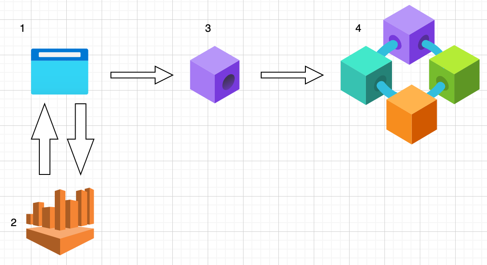

# Updated design

Initially it was thought that I could generate a transaction in the backend of the application, and sign that transaction from the frontend with metmask. However, to deploy a smart contract, a Private key is required. Due to the design of metamask, the private key is not exposed via the web3 api to stop malicious sites querying it and stealing funds.

This is where I run into a problem. The for me to compile my smart contract from the .sol file I will need to generate the required binaries on the front end.

In order to sign the transaction from metmask I have re-engineered the architecture

1. Frontend - The frontend will now be responsible for the users selection for their contract components, aswell as the generation of the binaries for the smart contract, from there it will contact the infrua node and deploy the contract.

2. Backend - Still written in Go will generate the .sol file. Unfortunately the Backend may now be slightly anemic

3. Infura - The roll of the Infura node hasn't changed, its still our on-ramp to the test network.

4. Testnet - The promised land for the smart contract.

Now, I am unsure as to how to proceed, wheter the golang portion is of any use, it might be best to just continue with just the javascript frontend.